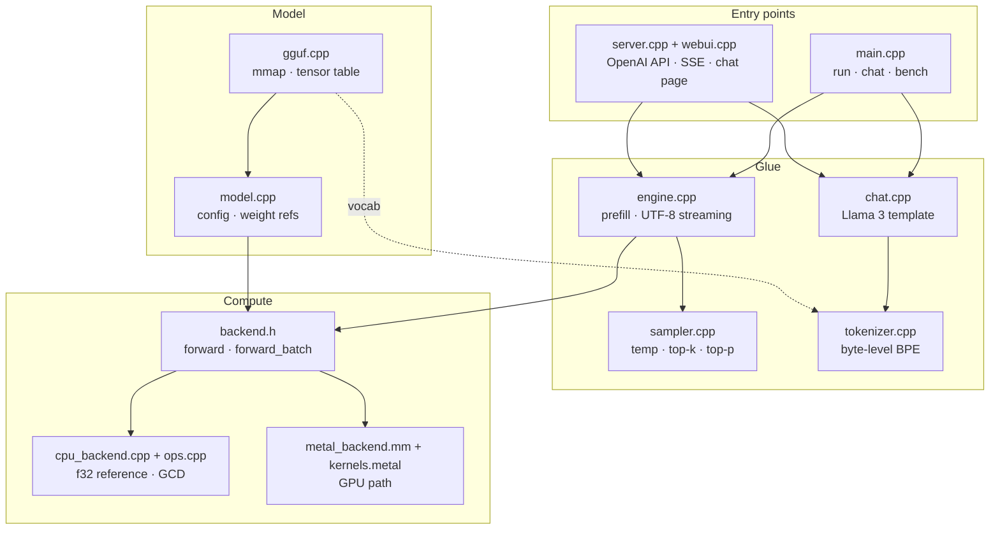
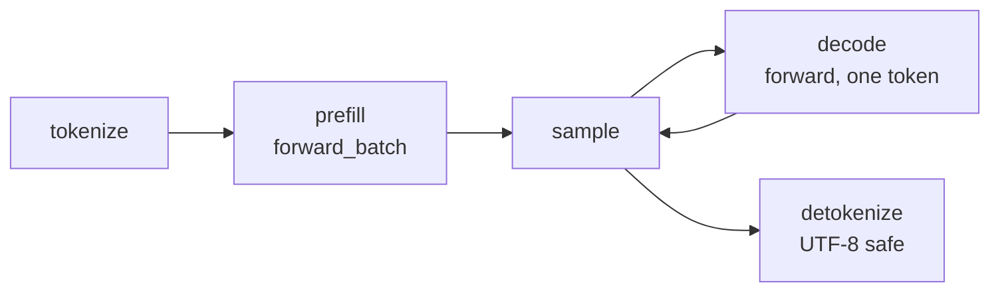
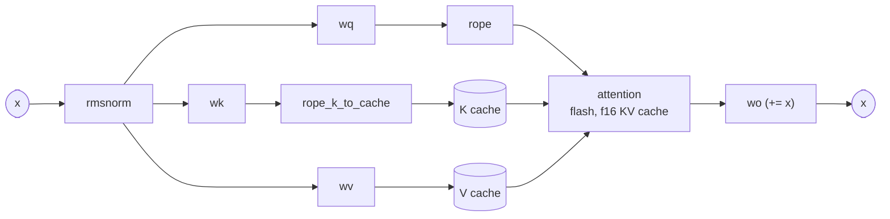
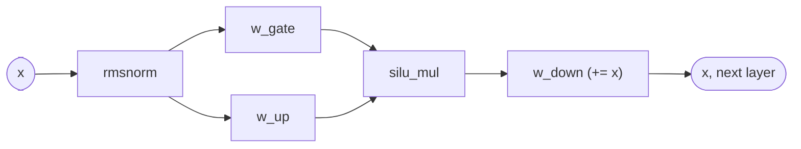

<div align="center">

# Ingot

**An LLM inference engine for Apple Silicon, cast from scratch in C++20 and Metal.**

No PyTorch. No MLX. No llama.cpp. One binary.


</div>

---

Ingot loads a GGUF model file, tokenizes, runs the transformer on the GPU, and streams
text back. It ships as a single executable with a CLI, a multi-turn chat REPL, and an
OpenAI-compatible HTTP server that also serves a browser chat page.

Correctness is defined strictly: under greedy decoding, Ingot produces **token-identical
output to llama.cpp** on every quantization it supports. On decode, it runs at parity with
llama.cpp or faster.

```sh
make
./ingot serve models/Llama-3.2-3B-Instruct-Q4_0.gguf --port 8080
# open http://127.0.0.1:8080/
```

## Contents

- [Status](#status)
- [Requirements](#requirements)
- [Usage](#usage)
- [Architecture](#architecture)
  - [System overview](#system-overview)
  - [Module map](#module-map)
  - [One forward pass on the GPU](#one-forward-pass-on-the-gpu)
  - [Kernel design](#kernel-design)
  - [Memory](#memory)
- [Performance](#performance)
- [Testing](#testing)
- [Diagnostics and tuning](#diagnostics-and-tuning)
- [Limitations](#limitations)

## Status

Working end to end. As of September 2026:

| Area | State |
|---|---|
| GGUF loading (F32, F16, BF16, Q4_0, Q4_1, Q8_0, Q6_K) | ✅ Done |
| Llama 3 byte-level BPE tokenizer | ✅ 42/42 cases identical to `llama-tokenize` |
| CPU reference forward pass | ✅ Greedy output identical to `llama-simple` |
| Metal backend: bandwidth-bound matvec, tiled prefill, flash attention | ✅ Greedy output identical to `llama-simple` on Q4_0, Q8_0, F16 |
| Sampling: temperature, top-k, top-p, repetition penalty, seed | ✅ Done |
| Multi-turn chat REPL with persistent KV cache | ✅ Done |
| OpenAI-compatible server with SSE streaming | ✅ Done |
| Browser chat page served at `/` | ✅ Done |
| Long context | ✅ Tested to 4k tokens, bounded only by KV cache memory |
| Decode speed vs llama.cpp (M5) | ✅ At parity or faster |
| Prefill speed vs llama.cpp (M5) | 🔶 Roughly 75 to 80 percent |
| K-quants beyond Q6_K | ⬜ Not started |

## Requirements

- An Apple Silicon Mac. The Metal 4 tensor API used for prefill needs an M5-class GPU;
  on older chips Ingot falls back to a SIMD-group matmul automatically.
- Xcode Command Line Tools. Shaders compile at runtime, so full Xcode is not required.
- For the tests and scoreboard: `brew install llama.cpp` and Python 3.
- A Llama 3.2 3B Instruct GGUF in `models/` (gitignored).

## Usage

```sh
make                 # release build
make debug           # -O0, asserts, AddressSanitizer

./ingot info  <model.gguf>                                  # metadata and tensor table
./ingot run   <model.gguf> -p "The capital of France is" -n 32
./ingot run   <model.gguf> --chat -p "Explain RoPE in one paragraph." -n 200
./ingot run   <model.gguf> --backend cpu                    # reference path, no GPU
./ingot chat  <model.gguf>                                  # multi-turn REPL, KV cache kept across turns
./ingot serve <model.gguf> --port 8080                      # OpenAI-compatible API + chat page
./ingot bench <model.gguf> -p 128 -n 32 -r 3                # same shape as llama-bench
./ingot tokenize <model.gguf> -p "text" --pieces
```

Sampling flags for `run`, `chat` and `serve`: `--temp`, `--top-k`, `--top-p`,
`--repeat-penalty`, `--seed`. Context and batching: `--ctx N` (default 2048, or 8192 for
`serve`) and `--batch N` (prompt tokens per GPU pass, default 512).

The server accepts any OpenAI client:

```sh
curl http://127.0.0.1:8080/v1/chat/completions -H 'Content-Type: application/json' \
  -d '{"messages":[{"role":"user","content":"Hello"}],"stream":true}'
```

| Endpoint | Purpose |
|---|---|
| `POST /v1/chat/completions` | Chat completions, streaming (SSE) or not |
| `GET /v1/models` | Model list |
| `GET /health` | Liveness |
| `GET /` | Browser chat page |

CORS is open, so the page can be served from anywhere.

## Architecture

### System overview

Every entry point drives the same pipeline. Weights are never copied: the GGUF file is
mmap'd once, and the Metal backend wraps that mapping directly in GPU buffers.



The flow for one request:



**Prefill** pushes the whole prompt through `forward_batch` in chunks. **Decode** then
calls `forward` once per generated token. The glue in `engine.cpp` is the only place that
knows about both, so the CLI and the server share identical prefill, sampling, and
streaming behaviour.

### Module map

Each source file is one concern. Dependencies flow downward: nothing below the backend
interface knows about tokens, chat templates, or HTTP.

| Layer | Files | Responsibility |
|---|---|---|
| **Entry points** | `main.cpp` | CLI: `info`, `tokenize`, `detokenize`, `run`, `chat`, `bench`, plus kernel diagnostics |
| | `server.cpp` | Minimal HTTP/1.1 server. OpenAI chat-completions API, SSE streaming, chunked transfer, CORS |
| | `webui.cpp` | Single-page browser chat client, embedded as a string constant and served at `/` |
| **Glue** | `engine.cpp` | Backend construction, batched prefill, UTF-8-safe streaming of partial tokens |
| | `chat.cpp` | Llama 3 chat template built as token sequences, so special tokens go in by id and are never re-tokenized from text |
| | `sampler.cpp` | Repetition penalty, temperature, top-k, top-p; greedy when temperature is 0 |
| **Text** | `tokenizer.cpp` | Llama 3 byte-level BPE: regex pre-tokenizer, GPT-2 byte encoding, ranked merges |
| | `unicode.cpp`, `unicode_data.cpp` | Codepoint classes for the pre-tokenizer regex (letters, numbers, whitespace) |
| **Model** | `gguf.cpp` | GGUF parser. mmaps the file, reads metadata and the tensor table, resolves data pointers |
| | `model.cpp` | Llama config from metadata, per-layer weight table, RoPE frequency table. Norms dequantized at load; large matrices left in place |
| **Compute** | `backend.h` | The abstract interface: `forward`, `forward_batch`, `n_ctx`. A backend owns its KV cache |
| | `cpu_backend.cpp`, `ops.cpp` | Reference f32 forward pass, one token at a time. Matvec parallelised over rows with Grand Central Dispatch, dequantizing on the fly |
| | `metal_backend.mm` | Production path. Wraps the mmap in `MTLBuffer`s, compiles shaders at runtime, encodes ~14 dispatches per layer into one command buffer per forward |
| | `shaders/kernels.metal` | All GPU kernels: quantized matvec, tiled matmul, RMSNorm, RoPE, KV store, flash attention (decode and prefill), SwiGLU |
| **Util** | `json.cpp` | Tiny JSON parser and serializer for the API |

### One forward pass on the GPU

For `n` tokens at positions `pos .. pos+n-1`, the Metal backend does:

1. **Embedding on the CPU.** Token embeddings are single rows, so they are dequantized
   straight into the shared `x` buffer. No kernel launch for a gather.
2. **One command buffer, one encoder** for all 28 layers. Each layer is the graph below.
   Residual adds are folded into the linear kernels via an `accumulate` flag, so there is
   no separate add pass.
3. **Logits for the last token only.** The final RMSNorm and output matvec run on one row
   regardless of `n`.
4. `waitUntilCompleted`, then the logits buffer is returned by pointer. Shared storage
   mode means the CPU reads it without a copy.

*Attention block:*



*Feed-forward block:*



The KV cache is f16, laid out `[n_layer][n_ctx][n_head_kv × head_dim]`. K is rotated and
converted to half in a single kernel on its way in.

### Kernel design

**Decode is memory-bound.** Every weight byte is read exactly once per token, so the
matvec kernels are built to saturate bandwidth:

- One SIMD group handles 4 rows and shares the `x` loads across them.
- Quantized nibbles are never shifted out. The masked value is multiplied by a
  pre-scaled `x` instead, saving an ALU op per element.
- Rows per SIMD group and SIMD groups per threadgroup are compile-time macros, tunable
  from the environment.

**Prefill is compute-bound.** Linear layers run as 64×32×32 tile products:

- On M5, through the Metal 4 tensor API (`mpp::tensor_ops::matmul2d`) on the matrix units.
- Elsewhere, through `simdgroup_matrix`.
- Weights are dequantized to f16 tiles in threadgroup memory. The output tile aliases the
  input tiles, so a threadgroup uses 8 KB and four fit per GPU core.

**Attention** is two flash-style kernels over the f16 cache:

- *Decode* splits the keys across threadgroups (default 8 splits), shares each K/V row
  across the 3 query heads of a GQA group, keeps a running max and sum (online softmax),
  and a tiny combine kernel merges the partials.
- *Prefill* computes `S = QKᵀ` and `O += PV` as 8×8 tile products on the SIMD-group
  matrix units, one SIMD group per (head, 8 queries), rescaling `O` with a diagonal
  matrix when the running max grows.

Everything else (RMSNorm, RoPE, SwiGLU, f32 → f16) is a small elementwise or
row-reduction kernel.

### Memory

| Buffer | Where | Size (Q4_0, ctx 8192) |
|---|---|---|
| Weights | mmap'd file, wrapped in `MTLBuffer`s, no copy | 1.9 GB |
| KV cache | GPU, f16 | 28 × 8192 × 1024 × 2 B × 2 = 0.9 GB |
| Activations | GPU, f32, sized by `--batch` | tens of MB |
| Logits | GPU, shared with CPU | 128k floats |

Because weights are mmap'd, the page cache does the work: a second process opening the
same model starts instantly.

## Performance

Measured on an M5 with 24 GB, back to back with `tests/bench.sh`. Tokens per second.

| Model | Prefill llama.cpp | Prefill Ingot | Decode llama.cpp | Decode Ingot |
|---|---|---|---|---|
| Q4_0 | 1496 | 1190 | 51.7 | **46.2** |
| Q8_0 | 1406 | 1051 | 26.0 | **28.6** |
| F16  | 1127 | 864  | 14.8 | **15.6** |

Absolute numbers drift with thermals and memory pressure. A cold run on Q4_0 in
September 2026 gave 1451 tok/s prefill and 58 tok/s decode.

Long context, Q4_0:

| Context | Prefill | Decode |
|---|---|---|
| 1k | 1252 | 45 |
| 4k | 1010 | 40 |

Before the flash attention kernels these were 739 / 243 prefill and 41 / 21 decode.

## Testing

Correctness means bit-identical output to llama.cpp under greedy decoding.

```sh
python3 tests/test_tokenizer.py                  # token ids identical to llama-tokenize (42 cases)
python3 tests/test_generate.py --backend cpu     # greedy text identical to llama-simple
python3 tests/test_generate.py --backend metal   # all three quantizations, 10 prompts each
tests/bench.sh                                   # scoreboard vs llama.cpp on Metal
```

The generation prompts include long ones so prefill exercises partial 32-token tiles and
multi-tile flash attention, not just the first tile.

## Diagnostics and tuning

```sh
LLM_PROFILE=1 ./ingot bench ...        GPU time vs wall time per forward
LLM_SKIP=attn,norm ./ingot bench ...   skip kernel families (wrong output, right timing)
LLM_NO_TENSOR=1 ./ingot bench ...      force the SIMD-group matmul instead of the tensor API
LLM_MV_NSG=2 LLM_MV_NR=4 ...           matvec shape (SIMD groups per threadgroup, rows per SIMD group)
LLM_NAIVE_ATTN=1 ...                   use the simple attention kernel (reference)
LLM_ATTN_SPLITS=8 ...                  key splits for decode attention

./ingot kcheck <model> [n_tok] [tensor] compare the tensor-API matmul against the SIMD-group one
./ingot kbench <model> [tensor]         GFLOP/s of one linear layer in isolation
./ingot abench <model> [pos]            time decode attention alone at a position
./ingot bwtest <model> [MB]             GPU read bandwidth per buffer type
```

## Limitations

- Llama architecture only, tested on Llama 3.2 3B Instruct. Other GGUF models with the
  same layout should load; other architectures will not.
- Quantization types: F32, F16, BF16, Q4_0, Q4_1, Q8_0, Q6_K. Other K-quants are not
  implemented.
- The server handles one request at a time. There is no batching across clients.
- Flash attention assumes `head_dim == 128`; contexts above 7000 tokens require it.
- macOS only. The CPU backend uses Grand Central Dispatch and the GPU backend is Metal.
